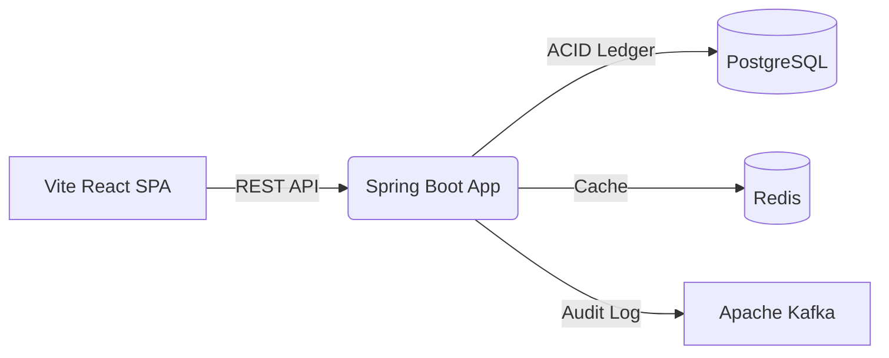

# FluxBanker

> An enterprise-grade, high-performance banking simulator demonstrating modern backend architecture and beautiful fintech UI design.


FluxBanker represents a full-stack financial application. It provisions mock checking/savings accounts, simulates ACID-compliant real-time money transfers between them, and produces asynchronous audit events via Kafka, all monitored through Prometheus and Grafana.

---

## Features

- **Ledger Architecture**: Pure double-entry accounting with strict ACID database transactions.
- **Role-Based Access Control (RBAC)**: Secure multi-role architecture with an exclusive Admin Dashboard for global transaction and user monitoring.
- **Deposit Simulation**: Built-in developer tooling to seamlessly inject initial funds into checking accounts.
- **Optimistic Locking**: Bullet-proof concurrency control preventing race conditions during transfers.
- **Event-Driven Audit**: Asynchronous publishing of `TransactionEvent`s to Kafka for decoupled audit logging.
- **High Performance Read Path**: Redis caching layer with intelligent write-evictions.
- **Observability**: Built-in Micrometer metrics exposing business KPIs (active accounts, transfer volumes) to Prometheus and Grafana.
- **Premium Fintech UI**: High-fidelity "Swiss Poster" aesthetic built with Vite, React 19, Zustand, and React Query. Features sharp Bento Grid layouts and IBM Plex Mono typography.

## System Architecture

FluxBanker uses a decoupled microservice-ready topology.



_For detailed technical diagrams, see the [Architecture Docs](docs/architecture.md)._

## Quick Start

Ensure you have Docker and Docker Compose installed.

### 1. Configure Environment

```bash
cp api/.env.example api/.env
```

### 2. Install Dependencies

```bash
make install
```

### 3. Start the Full Stack

We use a root Makefile to orchestrate the entire platform. To run everything (Infrastucture + API + Frontend) in dev mode:

```bash
make dev
```

Alternatively, to run just the backend in Docker:

```bash
make api-docker
```

### 4. Running Tests

FluxBanker supports three testing modes:

```bash
make test          # Local H2 (fastest)
make test-infra    # Host tests against real Docker services
make test-docker   # Full containerized test suite
```

## Observability

- **Grafana Dashboard**: `http://localhost:3000` (admin / admin)
- **Prometheus UI**: `http://localhost:9090`
- **Swagger API Docs**: `http://localhost:8080/swagger-ui.html`

## Documentation

- [Usage Guide](USAGE.md)
- [Developer Examples](docs/examples.md)
- [Architecture & Sequence Diagrams](docs/architecture.md)
- [Kafka Event Streaming](docs/kafka-events.md)
- [Redis Caching Strategy](docs/redis-caching.md)
- [Monitoring Setup](docs/monitoring.md)
- [REST API Reference](docs/api-reference.md) (Including cURL examples and Swagger info)
- [Deployment Guide](docs/deployment.md)

## Contributing

See [CONTRIBUTING.md](CONTRIBUTING.md) for local development guidelines, commit message standards, and code formatting rules.
