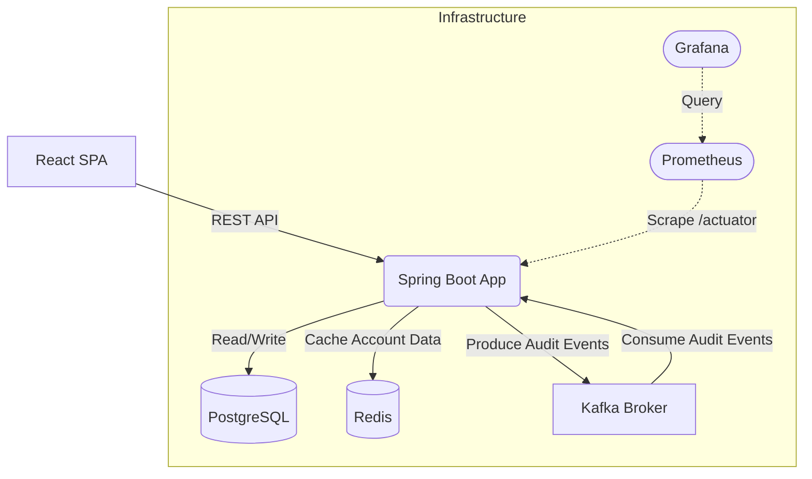
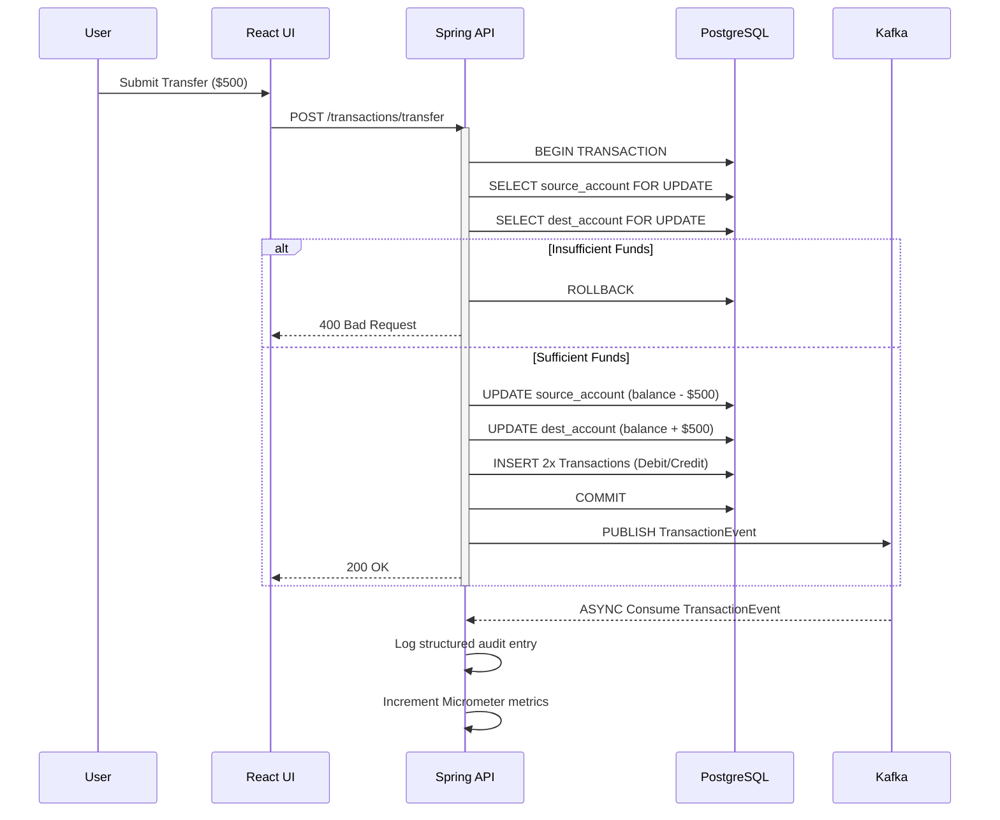

# Architecture Overview

FluxBanker is an enterprise-grade banking platform simulator built with a clear separation of concerns.

## Tech Stack

- **Frontend**: Vite, React 19, Zustand, React Query, Axios, Recharts.
- **Backend API**: Java 17, Spring Boot 3.
- **Database**: PostgreSQL (Flyway migrations).
- **Caching**: Redis.
- **Event Streaming**: Apache Kafka (KRaft mode).
- **Observability**: Prometheus & Grafana.

## Core Features Implemented

- **Double-Entry Ledger**: Ensures strict debit/credit equality.
- **RBAC (Role-Based Access Control)**: Enforces `USER` and `ADMIN` roles, offering an exclusive Admin Dashboard for global oversight.
- **Simulate Deposit**: Secure API to provision initial account liquidity for testing without requiring Plaid integrations.

## System Topology

## Data Flow: Money Transfer

