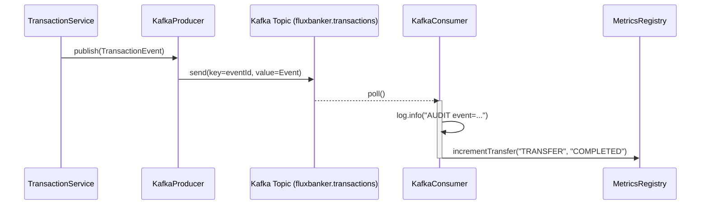

# Kafka Event Streaming

FluxBanker uses Apache Kafka to decouple the core transactional engine from downstream audit, reporting, and metrics aggregation systems.

## Why Kafka?

In a real-world core banking system, transferring money involves a strict ACID database transaction. However, sending push notifications, generating fraud alerts, and logging compliance audits do not need to block the user's HTTP request.

We use Kafka to publish an immutable `TransactionEvent` domain event after the Postgres transaction commits.

## Event Schema (`TransactionEvent`)

```json
{
  "eventId": "123e4567-e89b-12d3-a456-426614174000",
  "txType": "TRANSFER",
  "sourceAccountId": "abc...",
  "destinationAccountId": "def...",
  "amount": 500.0,
  "status": "COMPLETED",
  "occurredAt": "2024-04-28T14:00:00Z"
}
```

## Producer / Consumer Flow


