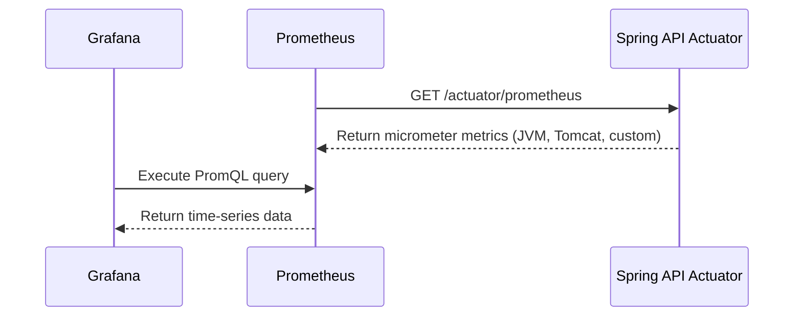

# Observability & Monitoring

FluxBanker includes a full monitoring stack using Prometheus and Grafana.

## Prometheus Scrape

Prometheus is configured to scrape the Spring Boot `/actuator/prometheus` endpoint every 5 seconds.

## Custom Metrics (`BankingMetrics.java`)

We expose domain-specific metrics to Prometheus via Micrometer:

1. `banking.accounts.active` (Gauge): Total provisioned accounts in Postgres.
2. `banking.transfers.total` (Counter): Total transfers, tagged by `type` and `status`.

## Grafana Dashboards

Grafana is provisioned automatically.

- **URL**: `http://localhost:3001`
- **Login**: `admin` / `fluxbanker`

Dashboards can be imported directly within Grafana using community IDs (e.g. `11378` or `4701` for JVM Micrometer dashboards) to instantly visualize Spring Boot metrics.
