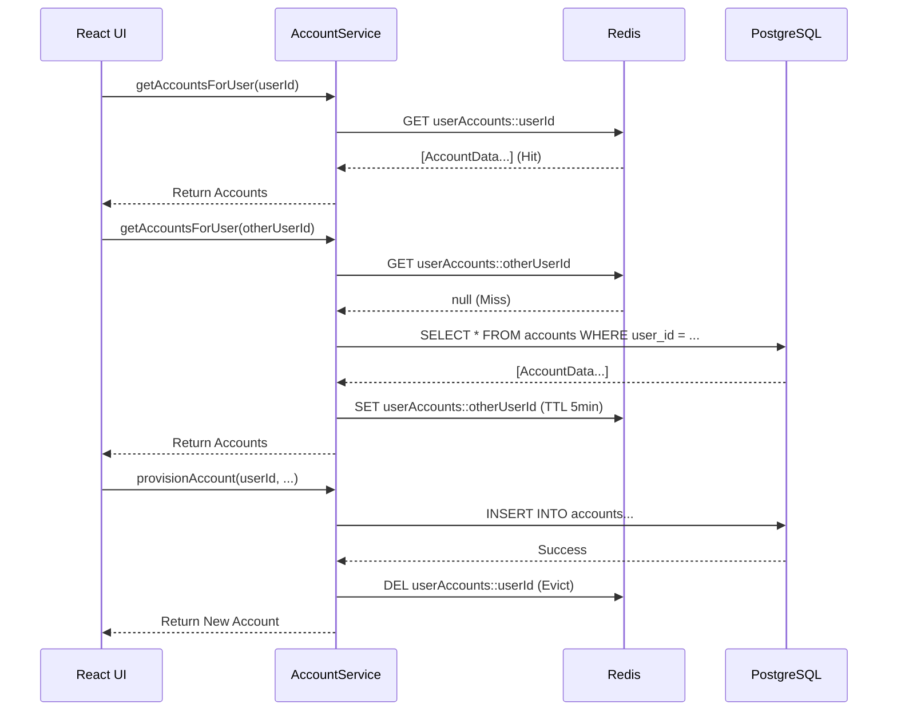

# Redis Caching Layer

To ensure high performance for read-heavy operations, FluxBanker utilizes Redis to cache account information.

## Strategy: Cache-Aside with Write-Eviction

1. **Read Path**: When the frontend requests a user's accounts, Spring checks Redis. If missing (`Cache Miss`), it queries Postgres and caches the result for 5 minutes.
2. **Write Path**: When an account is created or modified, Spring executes the database update and immediately evicts (`@CacheEvict`) the cached entry for that user to prevent stale data.

## Sequence Diagram

